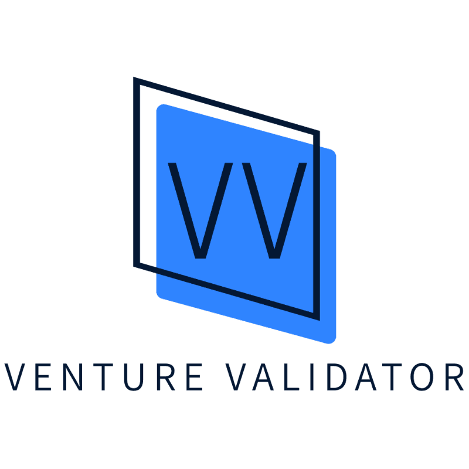
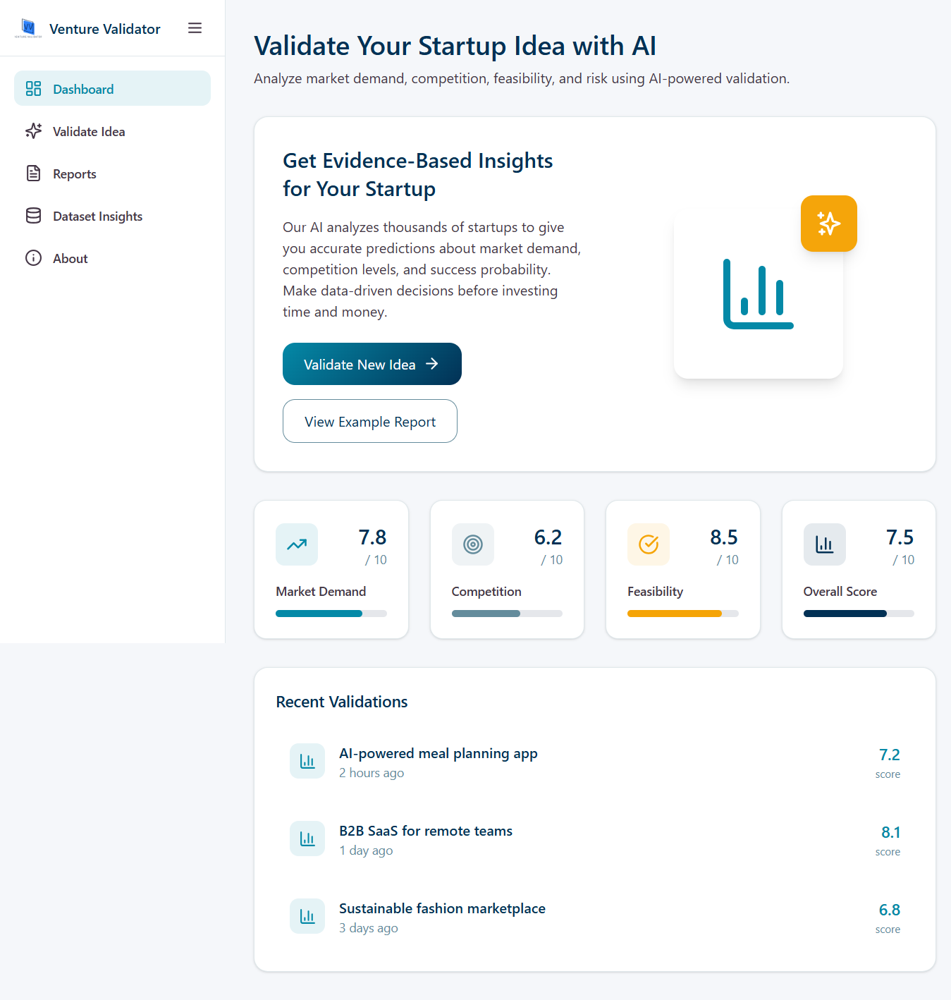
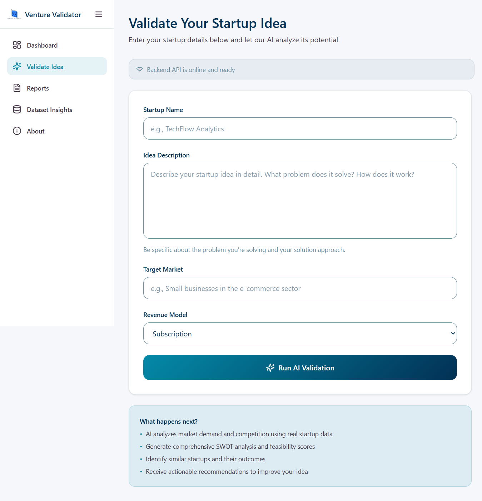
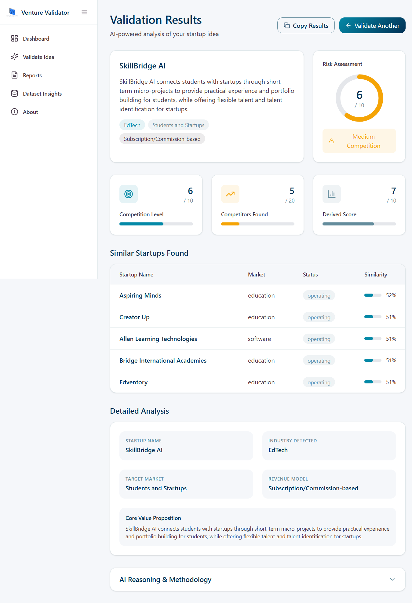

<p align="center">
  
</p>

<h1 align="center">Venture Validator</h1>

<p align="center">
  <strong>AI-Powered Multi-Agent Startup Idea Validation Platform</strong>
</p>

<p align="center">
  
  
  
  
  
  
</p>

---

## 🚀 What is Venture Validator?

**Venture Validator** is an AI-powered platform that validates startup ideas using a **multi-agent pipeline**. It analyzes your raw startup idea and produces a comprehensive report covering market demand, competitor landscape, feasibility, risk assessment, and actionable recommendations.

Enter a startup idea → get an instant, data-driven validation report with scores and insights.

---

## ✨ Key Features

| Feature | Description |
|---------|-------------|
| 🤖 **Multi-Agent Pipeline** | Three specialized AI agents analyze your idea in sequence: Idea Understanding → Competitor Similarity → Scoring Engine |
| 🔗 **LangGraph Orchestration** | Powered by LangGraph with parallel fan-out (competitor, market, failure agents run concurrently) |
| 🧠 **Gemini 2.5 Flash** | Uses Google's latest Gemini model for idea analysis and structured data extraction |
| 📊 **Vector Similarity Search** | ChromaDB-backed semantic search across 15,000+ real startups from a Crunchbase/Kaggle dataset |
| 📈 **Composite Scoring** | Weighted feasibility score (0–100) combining survival rate, competition, demand, and funding metrics |
| ⚠️ **Risk Classification** | Automatic Low / Medium / High risk classification with dynamic recommendations |
| 🎨 **Modern Dashboard** | React + Vite + Tailwind CSS + MUI + Radix UI — multi-page SPA with Dashboard, Validate, Results, Reports, and Settings pages |
| 📋 **Streamlit Alternative** | A second Streamlit-based frontend for quick prototyping |
| 🧪 **Fully Testable** | Unit and integration tests for the API, agents, and pipeline |

---

## 🏗️ Architecture

```
┌──────────────────────────────────────────────────────────┐
│                   User (Browser)                         │
│              React Dashboard / Streamlit                 │
└────────────────────┬─────────────────────────────────────┘
                     │ HTTP POST /validate
                     ▼
┌──────────────────────────────────────────────────────────┐
│                FastAPI Backend (main.py)                  │
│                                                          │
│  ┌────────────────────────────────────────────────────┐  │
│  │          LangGraph Pipeline (StateGraph)            │  │
│  │                                                    │  │
│  │  ┌──────────┐    ┌──────────────┐                  │  │
│  │  │  Input   │───▶│  Retrieval   │                  │  │
│  │  │  Agent   │    │  Agent       │                  │  │
│  │  │ (Gemini) │    │ (ChromaDB)   │                  │  │
│  │  └──────────┘    └──────┬───────┘                  │  │
│  │                         │                          │  │
│  │              ┌──────────┼──────────┐               │  │
│  │              ▼          ▼          ▼               │  │
│  │        ┌──────────┐ ┌────────┐ ┌─────────┐        │  │
│  │        │Competitor│ │Market  │ │Failure  │        │  │
│  │        │Agent     │ │Agent   │ │Agent    │        │  │
│  │        └────┬─────┘ └───┬────┘ └────┬────┘        │  │
│  │             │           │           │              │  │
│  │             └───────────┼───────────┘              │  │
│  │                         ▼                          │  │
│  │              ┌──────────────────┐                  │  │
│  │              │ Normalization    │                  │  │
│  │              │ Layer            │                  │  │
│  │              └────────┬─────────┘                  │  │
│  │                       ▼                            │  │
│  │              ┌──────────────────┐                  │  │
│  │              │ Scoring Agent    │                  │  │
│  │              └────────┬─────────┘                  │  │
│  │                       ▼                            │  │
│  │              ┌──────────────────┐                  │  │
│  │              │ Insight          │                  │  │
│  │              │ Generator        │                  │  │
│  │              └──────────────────┘                  │  │
│  └────────────────────────────────────────────────────┘  │
└──────────────────────────────────────────────────────────┘
```

### Agent Roles

| Agent | Role | Technology |
|-------|------|------------|
| **Input Agent** | Extracts structured data (industry, keywords, proposition) from raw idea text | Gemini 2.5 Flash |
| **Retrieval Agent** | Finds similar startups using semantic vector search | ChromaDB |
| **Competitor Agent** | Calculates competition score from number of similar startups | Python (metric-based) |
| **Market Agent** | Computes demand and funding scores from startup funding data | Python (metric-based) |
| **Failure Agent** | Determines survival rate from startup status data | Python (metric-based) |
| **Normalization Layer** | Clamps all metric values to [0, 1] range | Python |
| **Scoring Agent** | Computes weighted feasibility score (0–100) using opportunity–risk model | Python |
| **Insight Generator** | Produces qualitative insights and actionable recommendations | Python |

---

## 📸 Screenshots

<p align="center">
  
</p>
<p align="center"><em>Dashboard — Overview of the platform</em></p>

<p align="center">
  
</p>
<p align="center"><em>Validate Idea — Enter your startup idea</em></p>

<p align="center">
  
</p>
<p align="center"><em>Validation Results — Scores, competitors, and recommendations</em></p>

---

## 🛠️ Tech Stack

### Backend
- **Python 3.9+** — Core language
- **FastAPI** — REST API framework
- **LangGraph** — Multi-agent graph orchestration
- **Google Gemini 2.5 Flash** — LLM for idea understanding
- **ChromaDB** — Vector database for semantic startup search
- **Pandas** — Data cleaning and processing
- **Pydantic** — Request/response validation
- **Streamlit** — Alternative frontend UI

### Frontend
- **React 18** — UI framework
- **Vite** — Build tool and dev server
- **Tailwind CSS 4** — Utility-first styling
- **MUI (Material UI) 7** — Component library
- **Radix UI** — Accessible primitives
- **Recharts** — Data visualization
- **React Router 7** — Client-side routing
- **Lucide React** — Icon library

---

## ⚡ Quick Start

### Prerequisites

- Python 3.9+
- Node.js 18+ & npm
- A [Google Gemini API key](https://aistudio.google.com/app/apikey)

### 1. Install Dependencies

```powershell
# Backend
python -m venv venv
.\venv\Scripts\activate
pip install -r backend\requirements.txt

# Frontend (new terminal)
cd frontend
npm install
```

### 2. Configure Environment

```powershell
copy backend\.env.example backend\.env
# Edit backend/.env and add your GEMINI_API_KEY
```

### 3. Load Dataset into ChromaDB (One-Time)

```powershell
.\venv\Scripts\activate
cd backend
python -c "from agents.competitor_agent import load_csv_to_database; load_csv_to_database()"
```

> This embeds ~15,000 startups into a local vector database. Takes 2–5 minutes on first run.

### 4. Start the Application

**Terminal 1 — Backend:**
```powershell
.\venv\Scripts\activate
cd backend
uvicorn main:app --reload
```

**Terminal 2 — Frontend:**
```powershell
cd frontend
npm run dev
```

### 5. Open in Browser

- 🌐 **React Dashboard:** http://localhost:5173
- 📡 **API Docs (Swagger):** http://127.0.0.1:8000/docs
- 📋 **Streamlit UI (optional):** Run `streamlit run backend/app.py` → http://localhost:8501

---

## 📂 Project Structure

```
Startup-validator/
├── backend/                    # FastAPI server + AI pipeline
│   ├── agents/                 # Agent implementations
│   │   ├── idea_agent.py       # Agent 1: Idea Understanding (Gemini)
│   │   ├── competitor_agent.py # Agent 2: Competitor Similarity (ChromaDB)
│   │   └── scoring_agent.py    # Agent 3: Scoring Engine
│   ├── graph/                  # LangGraph orchestration
│   │   ├── state.py            # Shared TypedDict state
│   │   ├── nodes.py            # Node functions (8 nodes)
│   │   └── builder.py          # StateGraph construction
│   ├── main.py                 # FastAPI entry point (/validate endpoint)
│   ├── app.py                  # Streamlit frontend (alternative UI)
│   ├── langgraph_pipeline.py   # LangGraph pipeline controller
│   ├── pipeline.py             # Legacy direct pipeline
│   ├── models.py               # Pydantic models
│   ├── llm_service.py          # Gemini API wrapper
│   ├── scoring.py              # Scoring integration wrapper
│   └── requirements.txt        # Python dependencies
├── frontend/                   # React + Vite + Tailwind dashboard
│   ├── src/
│   │   ├── app/
│   │   │   ├── pages/          # Dashboard, Validate, Results, Reports, etc.
│   │   │   ├── components/     # Layout, ScoreCard, UI primitives
│   │   │   ├── api.ts          # Backend API service
│   │   │   ├── routes.ts       # React Router config
│   │   │   └── ValidationContext.tsx  # Shared state
│   │   └── main.tsx            # App entry point
│   ├── index.html
│   ├── package.json
│   └── vite.config.ts          # Vite config with API proxy
├── data/
│   ├── raw/kaggle/             # Original VC investment dataset (12MB)
│   ├── interim/                # Intermediate cleaned data
│   └── processed/              # Final cleaned CSV for ChromaDB
├── utilities/                  # Data cleaning, setup scripts
├── prompts/                    # LLM prompt design documents
├── tests/                      # Unit & integration tests
├── Screenshots/                # UI screenshots
└── docs/                       # Additional documentation
```

---

## 🧪 Testing

```powershell
# Activate virtual environment
.\venv\Scripts\activate

# Run all tests
python -m pytest tests/ -v

# Test individual components
python backend\agents\scoring_agent.py     # Scoring engine standalone test
python backend\agents\competitor_agent.py  # Competitor agent test + DB load
```

---

## 📡 API Reference

### `GET /`
Health check endpoint.

**Response:**
```json
{ "status": "running", "message": "Venture Validator API is live." }
```

### `POST /validate`
Validate a startup idea through the multi-agent pipeline.

**Request Body:**
```json
{
  "startup_name": "EduAI",
  "idea_description": "An AI tool that automatically summarizes long YouTube videos into study notes",
  "target_market": "Students",
  "revenue_model": "Subscription"
}
```

**Response** (abbreviated):
```json
{
  "startup_name": "EduAI",
  "industry_detected": "EdTech",
  "competition_score": 7.5,
  "feasibility_score": 62.5,
  "risk_level": "Medium",
  "market_score": 4.2,
  "overall_validation_score": 6.25,
  "competitors": [...],
  "scoring_report": {
    "score": 62.5,
    "risk": "Medium",
    "confidence": 0.25,
    "metrics": {...},
    "insights": {...},
    "recommendations": [...]
  }
}
```

---

## 🔧 Troubleshooting

| Problem | Solution |
|---------|----------|
| `ModuleNotFoundError: No module named 'google.genai'` | Run `pip install google-genai` (the package name is `google-genai`, not `google-generativeai`) |
| `[Competitor Agent] ERROR: CSV not found` | Ensure `data/processed/cleaned_investments_sent.csv` exists. Run data cleaning first. |
| `[Agent 2] WARNING: Database is empty!` | Run the ChromaDB loading command (Step 3 in Quick Start). |
| Frontend shows "Cannot connect to backend" | Ensure the FastAPI server is running on port 8000. |
| `npm install` fails | Ensure Node.js 18+ is installed. Try deleting `node_modules/` and `package-lock.json`, then retry. |
| Gemini API errors | Verify your `GEMINI_API_KEY` in `backend/.env` is valid and has quota remaining. |
| Slow first request | The first request downloads the embedding model (~80MB). Subsequent requests are fast. |

---

## 🤝 Contributing

1. Fork the repository
2. Create a feature branch: `git checkout -b feature/my-feature`
3. Make your changes and commit: `git commit -m "Add my feature"`
4. Push to your branch: `git push origin feature/my-feature`
5. Open a Pull Request

---

## 📄 License

This project is for educational and demonstration purposes.

---

<p align="center">
  Built with ❤️ using FastAPI, LangGraph, Gemini AI, and React
</p>
